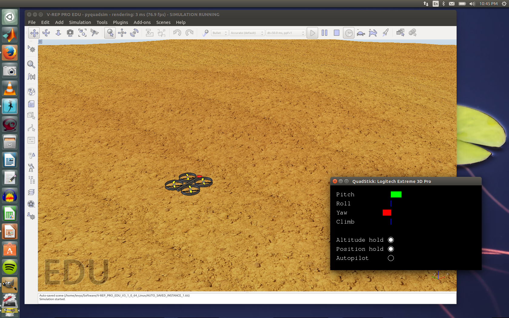

PyQuadSim
=========

A open-source quadrotor simulator in Python for Linux

NOTE: Because of the amount of extra work involved in cross-platform support,
I am no longer supporting this simulator on Windows or OS X.

<b>PyQuadSim</b> is a Python program that allows Linux users to fly a simulated quadcopter miniature aerial vehicle 
(MAV) from a variety of controllers (joystick, R/C transmitter, PS3
controller). You can modify the source code to add new sensors and other
features, as well as configuring the simulated environment for different kinds
of missions.  PyQuadSim uses the powerful Virtual Robot Experimentation
Platform (V-REP), but does not require programming in Lua or writing a plugin
in C++.  

<h3>Instructions</h3>

You will need:

<ol>
<li>The <a href="http://www.coppeliarobotics.com/downloads.html">V-REP simulator</a>

<li> The <a href="http://www.pygame.org/news.html">PyGame</a> package

<li> The <a href="http://home.wlu.edu/~levys/software/pyquadstick/">PyQuadStick</a> package

<li> The <a href="https://github.com/simondlevy/PyQuadSim">PyQuadSim package</a>

<li> Administrator (root) privileges on your computer

<li> Ability to program in Python, if you want to do more than fly with the defaults

<li> Ability to program (a little) lin Lua, if you want to add more sensors to the vehicle
</ol>

Once you've installed V-REP and PyQuad Stick and downloaded PyQuadSim, move the PyQuadSim folder into 
the folder where you installed V-REP.<a href="#fn1" id="r1">[1]</a> Next, edit the 
&ldquo;Import your controller here&rdquo; section of the
<b>pyquadsim_server.py</b> script to select the controller that you are using.  

Clicking on the start button (or selecting <b>Simulation / Start simulation</b>) should start the simulation.
If the simulation doesn't run, looking at the console outut at the bottom of the V-REP window will often tell 
you what's wrong. 

<h3>Modifying the simulator </h3>

To modify the simulator, you should understand how it works.  

As <a href="schematic.jpg">this diagram</a> shows, the simulator uses a client/server
mechanism, in which the V-REP Lua script is the client, sending the current sensor readings (IMU pitch, 
roll, yaw) to a server written in Python.  The Python script 
passes the readings, along with the current demands from the controller, to an 
<a href="docs/fmu.html">FMU object</a>.  
The FMU object passes the controller demands and sensor readings through a set of 
<a href="docs/pidconthrerol.html">PID controllers</a>
to stabilize the MAV and hold its 
position, computing appropriate thrust values for each motor.  The FMU object returns these
four thrust values to the server script, which sends them to the Lua client script.  The client
script converts the thrust values to forces and torques that are used to move the vehicle. 

Three simple ways to experiment with the simualtor would be:

<ol>
<li> Use the V-REP model browser (<b>Tools / Model browser</b>) to add obstacles like walls to the environment.

<li> In <tt><b>fmu.py</b></tt>, modify the PID parameters (<tt><b>K_p</b></tt>, <tt><b>K_d</b></tt>) 
based on a tutorial like this <a href="http://blog.oscarliang.net/quadcopter-pid-explained-tuning/">this one</a>

<li>Implement the altitude-hold feature, using the ultrasonic proximity sensor data that is passed to 
<tt>FMU.getMotors</tt> as <tt>extraData</tt>
</ol>

One you're familiar with V-REP and the code, you can try something more advanced, like adding additional sensors.
This will require modifying
<ol>
<li> Your V-REP scene

<li> <b>pyquadsim_client_init.lua</b> and <b>pyquadsim_client_loop.lua</b>

<li> <b>pyquadsim_server_extra.py</b> and <b>fmu.py</b>
</ol>

I've already added a downward-facing ultrasonic (sonar) sensor for distance, which you can test by hitting the 
appropriate switch on your controller.  (On my PS3 controller clone, it's the square button.)  Hitting this
switch will cause the vehicle to hold altitude based on another PID controller.

To help you debug your Python code, a runtime error in the Python code will cause the PyQuadStick window to report 
an exception.  To detect syntax errors, we recommend using 
<a href="https://pypi.python.org/pypi/pyflakes">PyFlakes</a> or another Python-checker before trying out
any modifications.  Syntax errors and other major failures will usually cause the simulation to abort with an error.
For each simulation run, a log file is automatically created, containing whatever data you choose to write to it.

<h3>Known issues</h3>

<ul>
<li> This package will not work with previous (pre 3.1.3) releases of V-REP.  I don't have time to support backward-compatibility.
  
<li> When you modify the code and run the simulator, the Quadstick window may report an error indicating a problem in unpacking some of the
data (typically, image data).  Hitting ESC and re-running the simulator usually makes this problem go away.
</ul>

<h3>Personnel</h3>

Bipeen Acharya, Fred Gisa, and Simon D. Levy. Please <a href="mailto:simon.d.levy@gmail.com">contact Simon</a>
with any questions or suggestions.

<h3>Copyright and licensing</h3>

Copyright and licensing information (Gnu 
<a href="https://www.gnu.org/licenses/lgpl.html">LGPL</a>) 
can be found in the header of each source file.  V-REP licensing information can be found 
<a href="http://www.coppeliarobotics.com/helpFiles/en/licensing.htm">here</a>.

<h3>Acknowledgments</h3>

This work was supported in part by a  Commonwealth Research Commercialization Fund
grant from the Center for Innovative Technology (CRCF #MF14F-011-MS) and a
Lenfest summer research grant from Washington and Lee University.

<a href="#r1">[1]</a> 
If you put the <b>PyQuadSim</b> folder elsewhere (not recommended), you'll need to edit the V-REP script to reflect this:
launch V-REP and open the 
<b>pyquadsim.ttt</b> script from the pyquadsim folder. Go to the <b>Tools</b> menu, select <b>Scripts</b>,
and double-click on <b>Child script (associated with Quadricopter)</b>. Edit the value of the 
<tt><b>PYQUADSIM_HOME</b></tt> variable to reflect where you put the folder and save the scene
(<b>File / Save scene</b>). 

